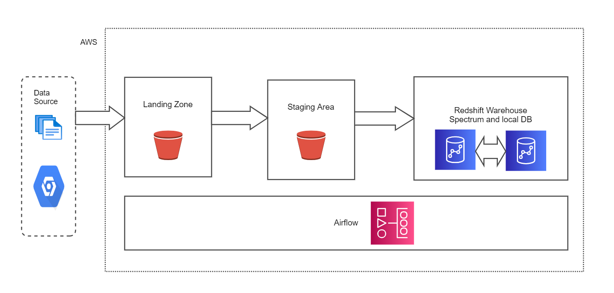

# House_sale_datapipeline

  - [1. Objective](#1-objective)
  - [2. Design](#2-design)
  - [3. Setup](#3-setup)
    - [3.1 Prerequisite](#31-prerequisite)
  - [4. Stop](#4-stop)
  - [5. References](#5-references)

## 1. Objective
Build data pipeline for curating house sales data with neighbourhood details for analysis

## 2. Design

Build a data pipeline to populate the `sales_with_nghbrhd` table. The `sales_with_nghbrhd` table is an OLAP table, meant to be used by analysts, data science team, etc.

1. `sales_with_nghbrhd`: OLTP table with house sales information.
2. `kc_house_data.csv`: Data containing houses sold from 2014-2015 in King County
3. Google Place API : Data for collecting neighbourhood details




1. Get the houses sales data to landing zone (AWS S3)
2. Move the data to be loaded from landing to staging (AWS S3) and perform data quality checks
3. Extract neighbourhood information from Googles Places API
4. Transform and Load the sold house and its neighbourhood details to final datawarehouse (Redshift) table
5. We will be using AWS Managed Workflows with Apache Airflow to orchestrate the flow

## 3. Setup

### 3.1 Prerequisite

1. [AWS account](https://aws.amazon.com/)

To set up the infrastructure and base tables we have a script called `setup_infra.sh`. 

Optinal - you can spin up cloud9 instance for developement as this comes with aws cli pre configured.

## 5. Stop

To stop and remove all your AWS services. 

```bash
./tear_down.sh {your-bucket1-name} {your-bucket2-name}
```

## 6. Reference and credits
#TODO
